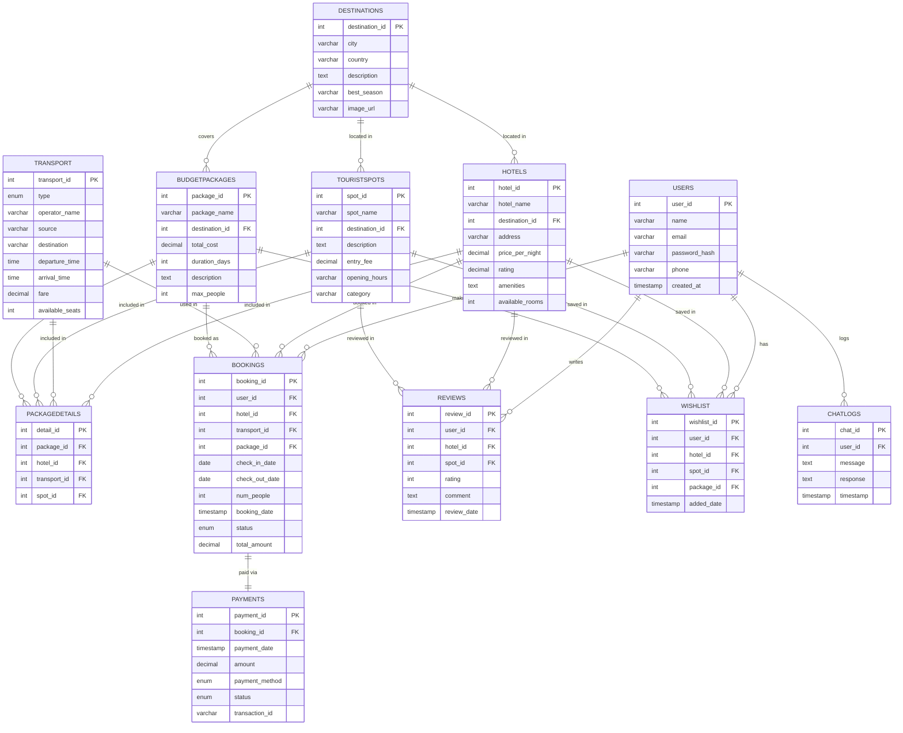

# Smart Travel Planner — ER Diagram

> **How to view this:**
> - Open VS Code → install extension "Markdown Preview Mermaid Support"
> - Then open this file and press `Ctrl+Shift+V`
> - OR paste the code block at https://mermaid.live

